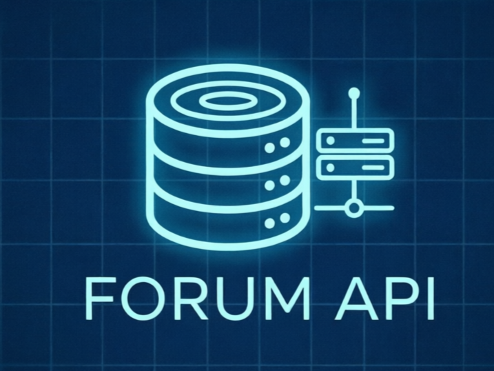

<div align="center">
  
</div>

# Forum Backend API

Серверная часть веб-форума. Реализует REST API для управления пользователями, темами и сообщениями.

## Статус разработки

Бэкенд находиться на доработке.
Текущие задачи:
* Реализация регистрации пользователей с подтверждением через почту.
* Реализация 'медовой ловушки' (honey pot) для защиты от ботов.
Для взаимодействия с API рекомендуется использовать curl, Postman или Insomnia.

## Технологический стек

* **Runtime:** Node.js
* **Framework:** Express
* **Database:** SQLite3
* **Security:** JWT, bcrypt
* **Utils:** dotenv, cors

## Функциональность

**Аутентификация и пользователи:**
* Регистрация и вход с выдачей JWT-токена.
* Ролевая система (root, moder, user).
* Редактирование профиля и удаление аккаунта.

**Контент:**
* Создание, чтение, обновление и удаление тем (threads).
* Создание, чтение, обновление и удаление постов (posts).
* Пагинация для списков тем и постов.

**Модерация:**
* Временная блокировка пользователей (бан).
* Назначение и изменение ролей (только для root).

## Установка и запуск

1. Клонирование и переход в директорию:
```bash
git clone git@github.com:naerlinad/forum.git
cd forum
```

2. Установка зависимостей:
```bash
npm install
```

3. Настройка переменных окружения:
```bash
cp .env.example .env
```
Откройте `.env` и задайте надежный `JWT_SECRET`.

4. Запуск сервера:
```bash
node server.js
```
При первом запуске база данных инициализируется автоматически. Будет создан пользователь `root` (пароль задается в `.env`, по умолчанию `changeme`).

## Переменные окружения

| Переменная | Описание | Значение по умолчанию |
|---|---|---|
| `PORT` | Порт сервера | `3000` |
| `JWT_SECRET` | Секретный ключ для подписи токенов | (обязательно) |
| `ROOT_USERNAME` | Имя администратора | `root` |
| `ROOT_PASSWORD` | Пароль администратора | `changeme` |

## Тестирование API

Примеры запросов через curl:

```bash
# Регистрация
curl -X POST http://localhost:3000/auth/register -H "Content-Type: application/json" -d '{"username":"test","password":"123456"}'

# Получение токена
curl -X POST http://localhost:3000/auth/login -H "Content-Type: application/json" -d '{"username":"test","password":"123456"}'

# Запрос с авторизацией (замените <TOKEN> на полученный токен)
curl -X GET http://localhost:3000/threads -H "Authorization: Bearer <TOKEN>"
```

## Справка по эндпоинтам

### Auth
| Метод | Путь | Описание |
|---|---|---|
| POST | `/auth/register` | Регистрация нового пользователя |
| POST | `/auth/login` | Аутентификация и получение токена |

### Threads & Posts
| Метод | Путь | Описание |
|---|---|---|
| GET | `/threads` | Список тем (поддерживает `?page` и `?limit`) |
| POST | `/threads` | Создание темы (требует авторизации) |
| GET | `/posts` | Список постов (требует `?thread_id`) |
| POST | `/posts` | Создание поста (требует авторизации) |

### Users & Moderation
| Метод | Путь | Описание | Доступ |
|---|---|---|---|
| PUT | `/users/:id` | Обновление профиля | Владелец, root |
| PUT | `/users/moderate/:id` | Бан/разбан пользователя | moder, root |
| PUT | `/users/setrole/:id` | Изменение роли | root |

Все защищенные маршруты требуют заголовок: `Authorization: Bearer <token>`.
